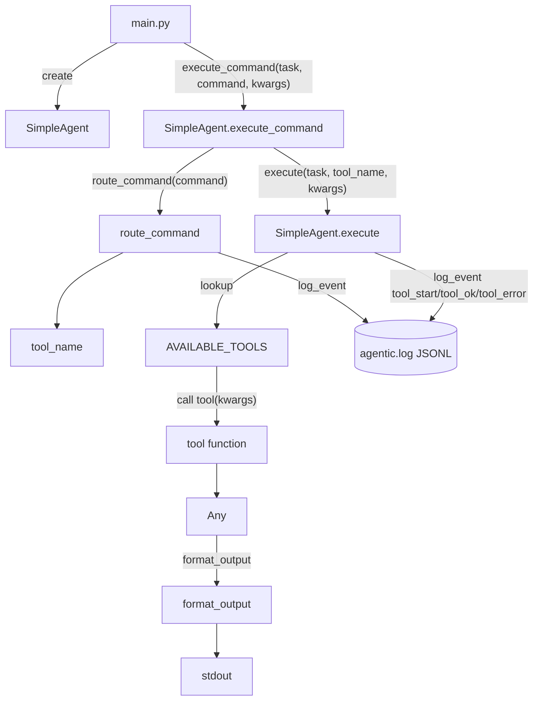

## primo-agente

Struttura base (layout `src/`) per un piccolo progetto “agentic”: un agente minimale che esegue **tool locali** (funzioni Python).

L’invocazione può avvenire in due modi:
- passando direttamente `tool_name` (API `SimpleAgent.execute(...)`)
- passando un `command` testuale (API `SimpleAgent.execute_command(...)`) che viene instradato dal router (`route_command`) verso un `tool_name`.

Al momento **non** c’è integrazione con un vero LLM: le dipendenze in `pyproject.toml` (`openai`, `python-dotenv`) sono già pronte per estensioni future, ma non vengono usate nel runtime attuale.

### Struttura repository

- `main.py`: esempio di utilizzo dell’agente (`SimpleAgent`) con 2 tool di esempio.
- `src/agentic/agent.py`: implementazione di `SimpleAgent` (instrada comandi, invoca i tool, formatta output).
- `src/agentic/router.py`: router comandi \(`command` -> `tool_name`\) con mapping `COMMAND_TO_TOOL`.
- `src/agentic/tools.py`: definizione dei tool e registry `AVAILABLE_TOOLS`.
- `src/agentic/io_utils.py`: formatting dell’output (`format_output`).
- `src/agentic/activity_log.py`: logging eventi su file (JSONL).
- `tests/`: test (tools/router/agent + smoke test logging).
- `.env.example`: esempio variabili ambiente (pronto per evoluzioni).

### Setup (sviluppo locale)

Requisiti: Python 3.x e `pip`.

1) Crea e attiva un virtualenv:

```bash
python3 -m venv .venv
source .venv/bin/activate
```

2) Installa il progetto (editable):

```bash
pip install -e .
```

3) (Opzionale) Prepara le variabili d’ambiente:

```bash
cp .env.example .env
```

Variabili utili:
- `AGENTIC_LOG_PATH`: path del file di log (default: `logs/agentic.log`). Il log è in formato **JSONL** (una riga JSON per evento).
- `OPENAI_API_KEY`: oggi **non** è letta dal codice; è solo un placeholder per future integrazioni.

### Esecuzione

Esegui lo script di esempio:

```bash
python3 main.py
```

Output atteso (indicativo):

- Un log tipo `[Zeta] Sto pensando al compito: ...`
- Un blocco formattato `--- RISULTATO AGENTE ---` per ogni tool invocato
- Un file di log creato/aggiornato in `logs/agentic.log` (o in `AGENTIC_LOG_PATH` se impostata)

Note importanti:
- `SimpleAgent.execute_command(task, command, **kwargs)` usa il router: se `command` è vuoto o sconosciuto, `route_command()` solleva `ValueError`.
- `SimpleAgent.execute(task, tool_name, **kwargs)` gestisce `tool_name` non registrati restituendo un messaggio di fallback (non solleva eccezione).

### Tool e comandi supportati (attuale)

Comandi (router `COMMAND_TO_TOOL`):
- `ora` -> `get_current_time`
- `somma` -> `add_numbers`

Tool registrati (`AVAILABLE_TOOLS`):
- `get_current_time()`: restituisce l’ora attuale come stringa \(formato `HH:MM:SS`\)
- `add_numbers(a: int, b: int)`: somma due interi

### Architettura (breve)



### Aggiungere un nuovo tool (quick guide)

1) Definisci una funzione in `src/agentic/tools.py`.

2) Registra la funzione in `AVAILABLE_TOOLS` con una chiave stringa.

3) Invoca il tool da `main.py` passando `tool_name` e gli argomenti richiesti.

Esempio (pseudo):

```python
def multiply(a: int, b: int):
    return a * b

AVAILABLE_TOOLS["multiply"] = multiply
```

### Test

I test sono disponibili in `tests/` e puoi eseguirli con:

```bash
pip install pytest
pytest
```

Cosa coprono:
- `tests/test_tools.py`: test unitari sui tool
- `tests/test_router.py`: routing comandi (normalizzazione + errori) e smoke test logging
- `tests/test_agent.py`: esecuzione tool, fallback su tool sconosciuto, routing via `execute_command`, smoke test logging
